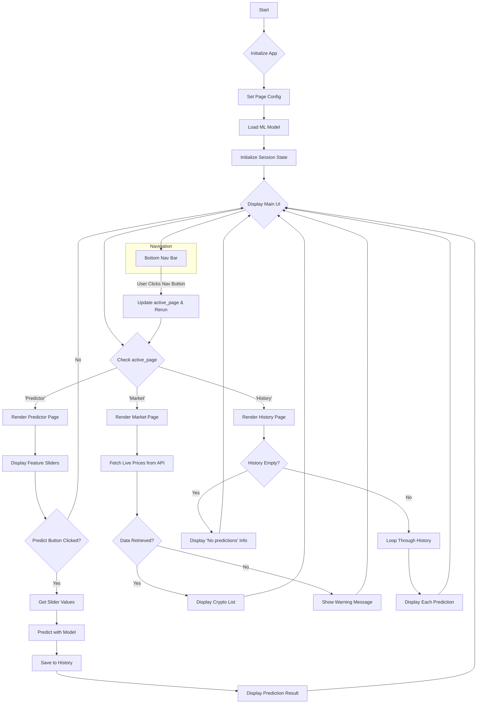

# Cryptocurrency-Prediction-App

live app link : (https://cryptocurrency-prediction-app.streamlit.app/)

```mermaid

graph TD
    A[Start] --> B{Initialize App};
    B --> C[Set Page Config];
    C --> D[Load ML Model];
    D --> E[Initialize Session State];
    E --> F{Display Main UI};
    F --> G{Check active_page};

    G -->|'Predictor'| H[Render Predictor Page];
    H --> I[Display Feature Sliders];
    I --> J{Predict Button Clicked?};
    J -->|Yes| K[Get Slider Values];
    K --> L[Predict with Model];
    L --> M[Save to History];
    M --> N[Display Prediction Result];
    N --> F;
    J -->|No| F;

    G -->|'Market'| O[Render Market Page];
    O --> P[Fetch Live Prices from API];
    P --> Q{Data Retrieved?};
    Q -->|Yes| R[Display Crypto List];
    R --> F;
    Q -->|No| S[Show Warning Message];
    S --> F;
    
    G -->|'History'| T[Render History Page];
    T --> U{History Empty?};
    U -->|Yes| V[Display 'No predictions' Info];
    V --> F;
    U -->|No| W[Loop Through History];
    W --> X[Display Each Prediction];
    X --> F;

    subgraph Navigation
        Y[Bottom Nav Bar]
    end

    F --> Y;
    Y -->|User Clicks Nav Button| Z[Update active_page & Rerun];
    Z --> G;

```
